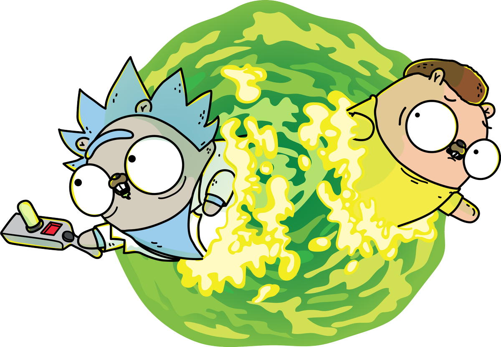
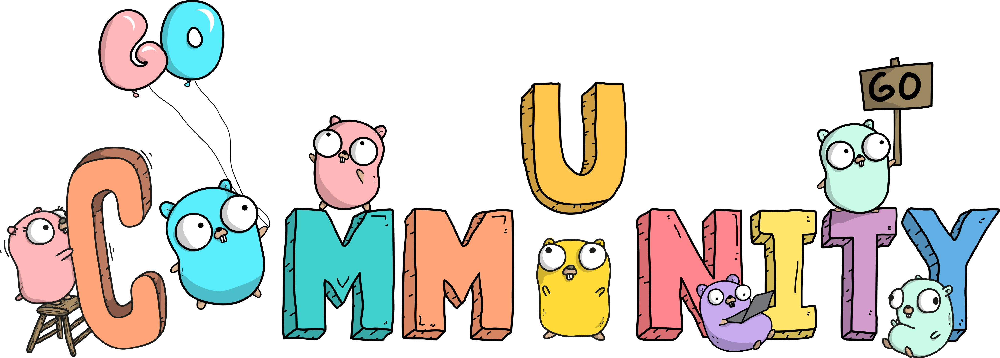

# L2 CodeMastery

Добро пожаловать в проект **L2** — учебный репозиторий с задачами для освоения различных тем в программировании на языке Go. 
Здесь представлено **12 заданий**, каждое из которых направлено на углубленное изучение паттернов проектирования, работы с файлами, строками, сетевыми взаимодействиями и написанием консольных утилит. 
Весь код структурирован по папкам в формате `L2.<task_number>`, где вы найдете соответствующие `.go` файлы и другие возможные ресурсы.

  

## Список заданий

### L2.1: Паттерны проектирования
Реализуйте следующие паттерны проектирования, изучите их применимость, преимущества и недостатки, а также приведите примеры их использования:
- **Фасад**
- **Строитель**
- **Посетитель**
- **Команда**
- **Цепочка вызовов**
- **Фабричный метод**
- **Стратегия**
- **Состояние**

### L2.2: Точное время через NTP
Создайте модуль Go для печати точного времени, используя библиотеку `github.com/beevik/ntp`. Программа должна корректно обрабатывать ошибки и возвращать ненулевой код выхода при сбоях.

### L2.3: Распаковка строки
Напишите функцию для распаковки строки, содержащей повторяющиеся символы, и реализуйте поддержку escape-последовательностей. Добавьте unit-тесты.

### L2.4: Сортировка строк в файле
Реализуйте утилиту для сортировки строк файла, аналогичную команде `sort`. Поддерживаемые параметры:
- `-k`: сортировка по колонке
- `-n`: числовая сортировка
- `-r`: обратный порядок
- `-u`: исключение повторяющихся строк

**Дополнительно:**

Реализовать поддержку утилитой следующих ключей:
- `-M`: сортировать по названию месяца;
- `-b`: игнорировать хвостовые пробелы;
- `-c`: проверять отсортированы ли данные;
- `-h`: сортировать по числовому значению с учетом суффиксов.

### L2.5: Поиск множеств анаграмм
Напишите функцию, которая находит все множества анаграмм в списке слов. Каждое множество должно включать слова в нижнем регистре и быть отсортировано.

### L2.6: Фильтрация строк (аналог `grep`)
Создайте утилиту для фильтрации строк с поддержкой параметров аналогичных `grep`, включая:
- `-A`: количество строк после совпадения
- `-B`: количество строк до совпадения
- `-C`: количество строк вокруг совпадения
- и другие.

### L2.7: Аналог команды `cut`
Разработайте утилиту, которая, как и `cut`, принимает строки из `STDIN`, разбивает на колонки и выводит запрошенные. Поддерживаемые параметры:
- `-f`: выбор полей
- `-d`: выбор разделителя
- `-s`: только строки с разделителем

### L2.8: Объединение каналов
Реализуйте функцию для объединения `done`-каналов в единый канал, который закрывается при закрытии одного из входящих каналов.

### L2.9: UNIX-шелл
Создайте консольную утилиту UNIX-шелл, поддерживающую команды:
- `cd`
- `pwd`
- `echo`
- `kill`
- `ps`
- и поддержку пайпов для конвейера команд.

### L2.10: Утилита wget
Реализуйте утилиту для загрузки веб-страниц с возможностью скачивать сайты целиком.

### L2.11: Telnet-клиент
Напишите простейший telnet-клиент с возможностью указания таймаута подключения и корректной обработки завершения соединения.

### L2.12: HTTP-сервер для работы с календарем
Создайте HTTP-сервер с API для работы с календарем. Поддержите следующие методы:
- `POST /create_event`
- `POST /update_event`
- `POST /delete_event`
- `GET /events_for_day`, `GET /events_for_week`, `GET /events_for_month`

Реализуйте middleware для логирования запросов и корректную обработку ошибок.

## Как использовать
- Каждый проект представлен в отдельной папке (`L2.<task_number>`).
- В каждой папке находятся `.go` файлы и другие ресурсы, если требуются для выполнения задания.
- Для запуска выполните `go run main.go` из соответствующей директории или выполните `go build` для создания исполняемого файла.
- Для запуска тестов используйте `go test`

## Заключение
Этот проект помогает практиковаться в написании приложений разного уровня сложности и охватывает широкий спектр тем, включая паттерны проектирования, работу с файлами, сетевые взаимодействия и реализацию консольных утилит.

  

